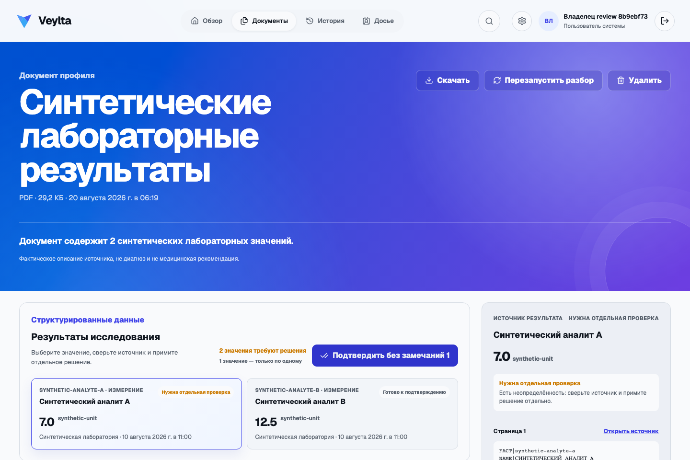
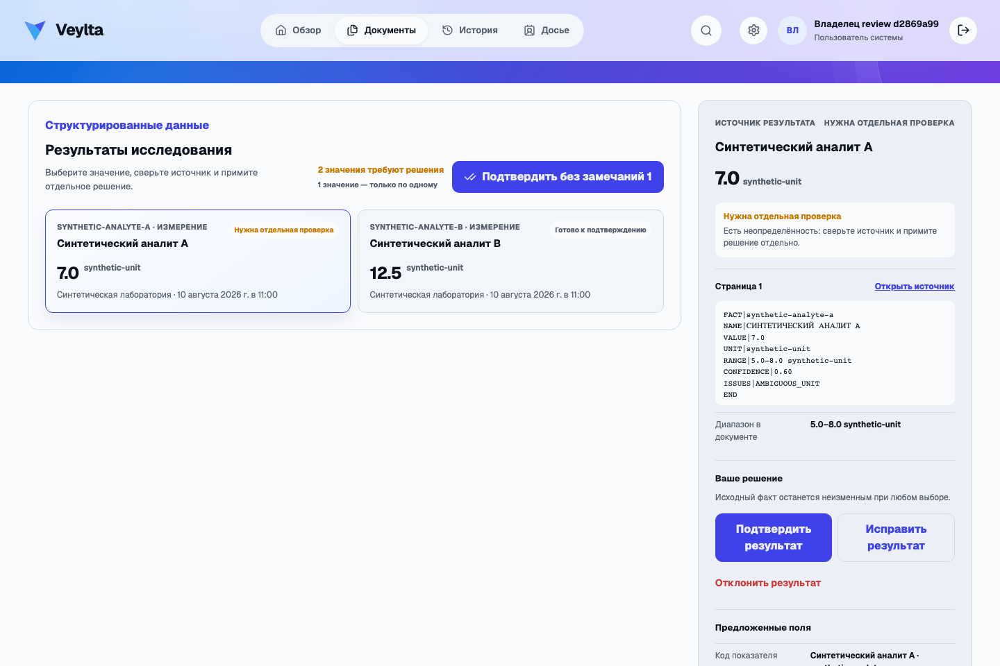
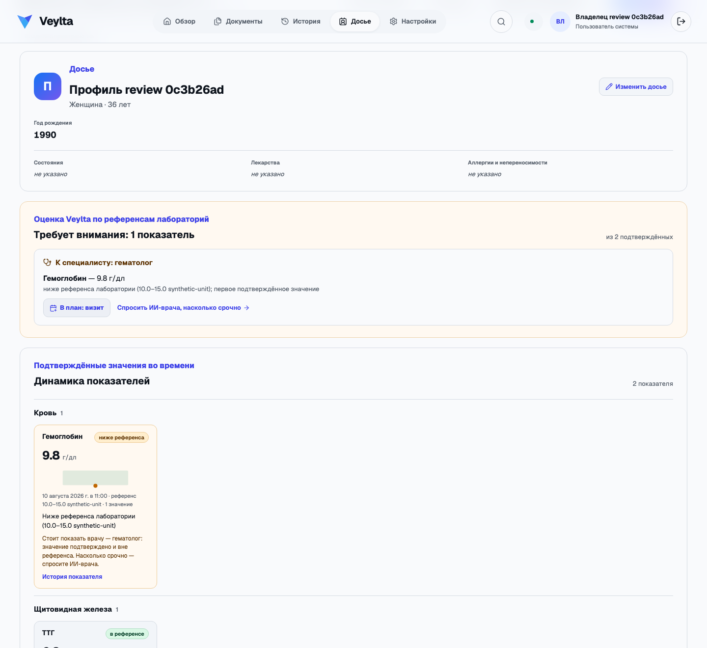
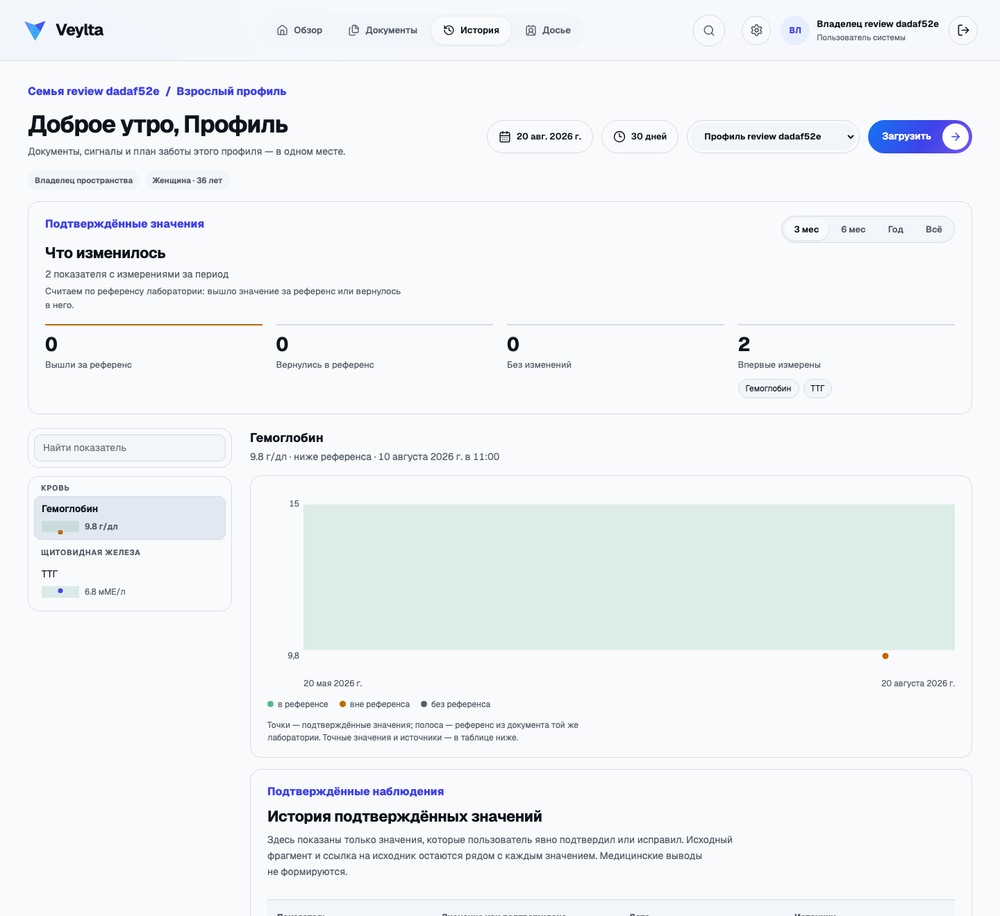
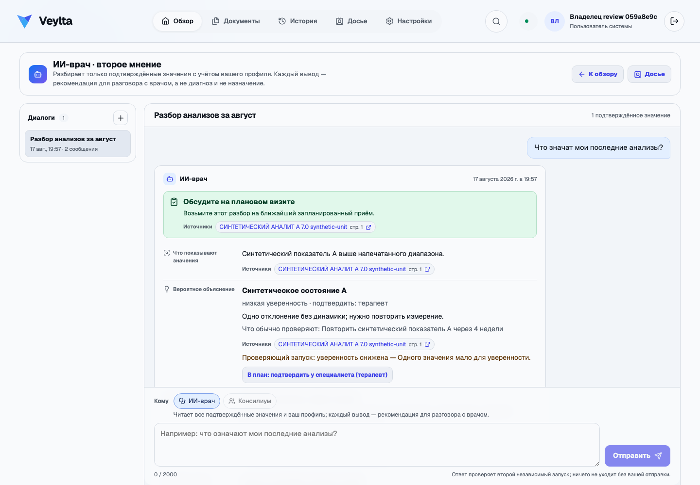
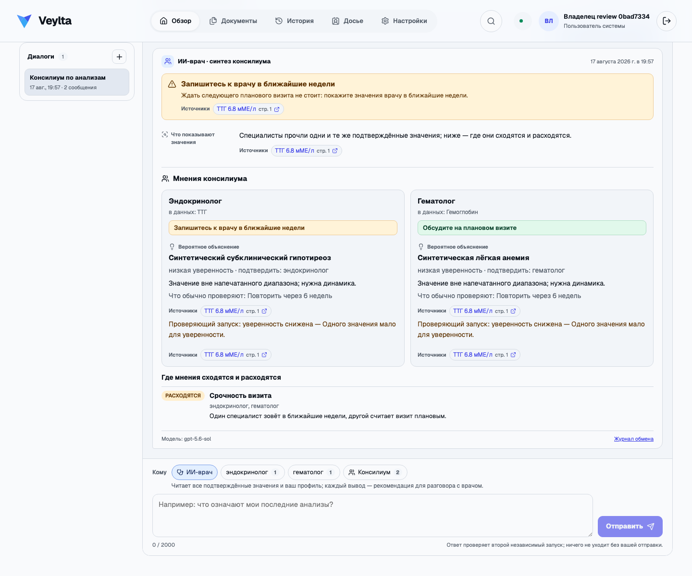
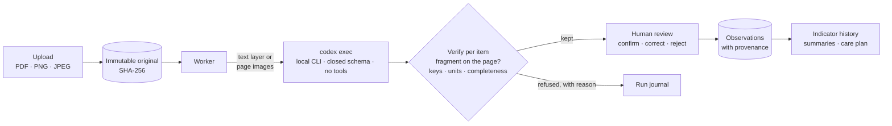

<p align="center">
  
</p>

<h1 align="center">Veylta</h1>

<p align="center">
  A local-first, family-scoped medical record.<br>
  Your documents stay on your machine, an AI extracts the numbers with a source citation for each,
  and nothing becomes a fact until you confirm it.
</p>

<p align="center">
  <a href="https://github.com/Braidner/veylta/actions/workflows/ci.yml"></a>
  <a href="LICENSE"></a>
  
  
  
  
</p>

<p align="center">
  <a href="#why-veylta">Why</a> ·
  <a href="#features">Features</a> ·
  <a href="#how-it-works">How it works</a> ·
  <a href="#quick-start">Quick start</a> ·
  <a href="#configuration">Configuration</a> ·
  <a href="#development">Development</a> ·
  <a href="#architecture">Architecture</a> ·
  <a href="#safety-and-data-policy">Safety</a> ·
  <a href="#license">License</a>
</p>

<p align="center">
  
</p>

> **Veylta** (“VAYL-ta”) is a coined name that evokes a protective *veil*: private by default, with
> every derived claim still traceable to its source. It helps a family understand its own health
> history and prepare for a conversation with a clinician. It does **not** diagnose, prescribe,
> change treatment, or replace a clinician or an electronic health record.

## Why Veylta

Health records end up scattered across lab portals, PDFs in mail and photos of printouts. Tools
that promise to “analyse” them usually mean *upload to our cloud and trust the score*. Veylta takes
the opposite stance:

- **Local-first.** One household machine: Fastify + a worker on SQLite, a local object root, a
  Next.js PWA on your LAN. No Veylta cloud, no telemetry, no account with anyone.
- **Source-first.** Originals are immutable and checksummed. Every extracted value cites the page
  and the exact printed line it came from — you can always open the source next to the number.
- **Human in the loop.** The model *proposes*; a person confirms, corrects or rejects each value.
  Only a confirmed value becomes an observation, and the raw extraction is never edited.
- **Assesses, then sends you to the right doctor.** Every finding is a recommendation that ends in
  a named specialist. Veylta's own rules say plainly what a confirmed value means against its printed
  reference range and how it moved since last time — never a single score, never a diagnosis from a
  rule. The **ИИ-врач · второе мнение** assistant reasons over confirmed values and your medical profile in
  typed, source-bound blocks — interpretation, ranked hypotheses, what a physician would consider,
  questions for the visit — under a mandatory urgency tier, each hypothesis naming the specialty
  that must confirm it, no doses ever, every answer refuted by a second independent run before it
  is shown. A recommendation for the conversation with your doctor, not a diagnosis.
- **Bounded AI.** Extraction runs through the locally authenticated [Codex CLI](https://github.com/openai/codex)
  with a closed JSON schema, tools disabled and every answer verified item by item. Veylta never
  reads, copies or stores the Codex credentials.

## Features

- **Batch upload** of PDF, PNG and JPEG (up to 20 files × 5 MiB): streaming SHA-256, signature and
  MIME checks, immutable originals, private per-family deduplication.
- **Extraction that shows its work.** A PDF text layer travels as text; scans and photos travel as
  bounded page images that Codex transcribes first. Every fact and summary result binds to a page
  fragment; unbound items are dropped, an incomplete laboratory answer is refused and retried, and
  every refusal names the exact rule it broke — visible in the run journal together with the raw
  request and answer.
- **Review workspace.** One selected value in context: the source fragment, the printed range,
  proposed fields, and only the applicable decisions. Bulk-confirm covers only values without
  warnings; every accepted item is still its own immutable decision.
- **Analyte catalog and history.** ~95 common blood-count, chemistry, hormone and coagulation
  analytes with canonical units and Russian/Latin spellings travel with every request, so codes come
  from a closed list; confirmed values chart per analyte with provenance back to the page.
- **Per-document Codex dialogues.** Up to 20 named Russian conversations per document over a
  short-lived, read-only loopback MCP tool that re-authorises the document scope on every call.
- **Досье — the cabinet.** The page a person shows their doctor: on the left a passport of what
  they recorded about themselves (sex, age, height, weight, BMI as a number, conditions,
  medications, allergies) and the record's areas as a rail — Кровь, Липиды, Печень, Щитовидная
  железа… — each with its indicator count and how many stand outside the printed reference; on
  the right the whole record or one area: what stands where, «требуют внимания» as gauge cards
  grouped by the specialty that reads them (the printed reference as a band, the value as a
  marker, the change since last time, results in a row outside the range) with «В план: визит»
  and «Спросить ИИ-врача, насколько срочно», then the remaining indicators. No score, no
  diagnosis, no conversion.
- **Записи врача и сверка.** A discharge summary or consultation yields the clinician's own
  statements — diagnoses, prescriptions as printed, referrals, follow-ups, findings — each bound
  to its page and fragment and decided one by one (as read, in your own words, or rejected). Only
  confirmed records reach the ИИ-врач; «Сверить с ИИ-врачом» asks it where it agrees with the
  doctor, where it differs and why, and what to ask at the visit — every difference is a question
  for the plan, never a score for a named clinician.
- **Medical profile and the ИИ-врач.** A person records sex, birth year, conditions, medications,
  allergies, symptoms and goals — user-authored, dated, revisioned, never inferred. The physician
  assistant reads that profile and the confirmed observations (each answer's evidence is disclosed
  and acknowledged per conversation before anything leaves the machine), answers in typed blocks
  bound to source pages, is refuted by an independent checker run, and refuses with a closed reason
  when a block cannot be verified. Accepting a referral puts one «подтвердить у специалиста» item
  into the care plan; the raw exchange stays in the owner's journal.
- **Консилиум on demand.** The confirmed values themselves name the specialists (ТТГ → an
  endocrinologist persona, a blood count → a hematologist, lipids → a cardiologist…); each reads
  the same evidence independently, the therapist synthesises with the highest urgency and says
  where they agree and differ, and every opinion is shown beside the synthesis. A chip lets you ask
  one specialist directly inside the same conversation.
- **ИИ-нутрициолог.** A second room over the same disclosed evidence, gate, checker and journal:
  what the confirmed values say about the diet, recommendations by category — structure, foods to
  favour or limit, a supplement by name or class (a dose refuses the block), hydration, timing —
  each read against the recorded conditions and medications with the interaction named and a
  specialty to confirm it, and what to measure again with the assistant's own phrase for when. An
  accepted recommendation becomes a «питание» item, a recheck an «анализы» item.
- **ИИ-тренер and the person's own diary.** A third room: what the confirmed values, the recorded
  constraints and the clinician's clearance say about physical activity — what to do, how much and
  how often, how to progress, what to avoid and when to stop, in the assistant's own words, each
  activity stating whether it sits within the recorded clearance and who confirms it. An accepted
  activity becomes an «активность» item; one that needs clearance becomes the visit that gives it.
  Under each accepted activity or nutrition item the person marks their days — done or skipped,
  with a note — and every assistant reads those marks, so progression follows what was actually
  done.
- **The outcome log.** After the visit, the person records what the clinician said about any
  block an assistant asked to confirm — confirmed, rejected or modified, dated, optionally tied to
  the confirmed clinician record that documents it. The room's rail counts the marks and the
  сверка's positions and lists the cases with a way back to each answer — counts and cases, never
  a rating of a named doctor. `pnpm eval:assistants` runs 30 synthetic vignettes through the very
  same turn against the local Codex CLI and reports where the model drifts.
- **Family and access.** An owner, adults with their own profiles, caregivers with a single
  revocable per-profile grant; reversible profile archiving that deletes nothing.
- **Evidence over time.** Versioned, evidence-backed health summaries; a household care plan whose
  Codex drafts stay `proposed` until a person decides; a payload-free audit log; a checksummed
  evidence bundle you can verify offline.
- **Installable PWA** served from the home machine, usable from any device on the LAN.

<p align="center">
  
</p>

<p align="center">
  
</p>

<p align="center">
  
</p>

<p align="center">
  
</p>

<p align="center">
  
</p>

## How it works



1. **Upload.** The API streams the file through SHA-256 and signature checks and stores the
   immutable original under a key derived from trusted IDs and the checksum — never the filename.
2. **Extract.** The worker claims a job, sends the text layer *or* bounded page images (never both)
   plus the household analyte catalog to `codex exec` with a closed output schema.
3. **Verify.** Each proposed result and fact is checked on its own: the cited fragment must occur on
   the named page (widened to the complete printed line), keys and units are reconciled, a
   model-proposed normalization survives only if it repeats the printed number, and a laboratory
   answer whose facts miss most of its own measurements is refused as `incomplete_facts`.
4. **Review.** A person confirms, corrects or rejects. Confirmations create observations in the same
   transaction; rejections create none; the raw fact is never mutated.
5. **Follow.** Confirmed observations feed indicator history, versioned summaries and the care plan
   — always as evidence with links back to the source, never as an assessment.

## Quick start

**Prerequisites**

| Requirement | Notes |
| --- | --- |
| Node.js ≥ 22.16 | uses the built-in `node:sqlite` — no database server, no containers |
| pnpm 10.4 | `corepack enable` installs the pinned version |
| [Codex CLI](https://github.com/openai/codex), signed in | `codex login` once; Veylta only shells out to it locally |
| Chromium for Playwright | `pnpm exec playwright install chromium` — e2e only |

**Run**

```bash
corepack enable
pnpm install --frozen-lockfile
pnpm db:migrate
pnpm dev
```

Open <http://127.0.0.1:4300>. On an empty installation the first visit creates the only
administrator, their home workspace and their linked profile in one transaction; later visits show
the local sign-in. The API listens on `127.0.0.1:4301`, worker health on `127.0.0.1:4302`; both stay
bound to loopback. State lives in `.local/veylta.sqlite`, document bytes under `.local/storage`.

To use Veylta from other devices on the LAN, copy `.env.example` to `.env`, list the machine's
address in `WEB_ORIGINS` (exact origins, no subnets or wildcards) and open
`http://<server-lan-address>:4300`.

## Configuration

Defaults match [`.env.example`](.env.example); copy it to `.env` only for local overrides.

| Variable | Default | Purpose |
| --- | --- | --- |
| `WEB_ORIGINS` | `http://127.0.0.1:4300,…` | Exact browser origins allowed to call the API. State-changing requests require a match. |
| `DATABASE_PATH` | `.local/veylta.sqlite` | The one SQLite file all three processes share (WAL, foreign keys, busy timeout). |
| `OBJECT_STORAGE_ROOT` | `.local/storage` | Local object root for immutable originals. An S3-compatible driver exists for synthetic operator testing only. |
| `MAX_DOCUMENT_BYTES` | `5242880` | Per-file upload cap. |
| `CODEX_MODEL` / `CODEX_REASONING_EFFORT` | `gpt-5.6-sol` / `medium` | Model and effort for dialogues; the settings page can pick a separate model and effort for document analysis and the assistants' effort (`CODEX_ASSISTANT_REASONING_EFFORT`, default `high`). |
| `CODEX_DOCUMENT_TIMEOUT_MS` | `600000` | One extraction run; the job lease (`PROCESSING_LEASE_DURATION_MS`) is a little longer. |
| `CODEX_DOCUMENT_AGENT_TIMEOUT_MS` | `120000` | One dialogue turn. |
| `SESSION_TTL_SECONDS` / `SESSION_COOKIE_SECURE` | `2592000` / `false` | Opaque session token in an HttpOnly cookie; SQLite stores only its SHA-256 digest. |
| `DEMO_REGISTRATION_ENABLED` | `false` | Legacy synthetic registration for the e2e runner; refused when any origin is non-loopback. |

## Development

The full check sequence, in CI order:

```bash
pnpm license:check && pnpm lint && pnpm typecheck && pnpm test && pnpm test:integration && pnpm build && pnpm test:e2e
```

Useful single commands:

```bash
pnpm --filter @veylta/api exec tsx --test src/processing/analyte-mapping.test.ts   # one unit test
pnpm --filter @veylta/api exec tsx --test --test-concurrency=1 test/document-upload.integration.test.ts
pnpm test:e2e e2e/document-review.spec.ts                                          # one e2e spec
pnpm db:rollback                                                                    # reverse the newest migration
README_SCREENSHOTS=1 pnpm test:e2e e2e/readme-screenshots.spec.ts                   # regenerate docs/media
```

Repository layout:

```
apps/api            Fastify API + worker: node:sqlite, migrations, Codex boundary
  src/processing/codex-intelligence   the extraction provider, one module per responsibility
  src/prompts                          every prompt, one file per prompt
apps/web            Next.js PWA (Russian UI) — pure logic lives in *.ts beside the components
packages/contracts  versioned contracts shared by api, web and tests
db/migrations       numbered up/down SQL, applied by pnpm db:migrate
e2e                 Playwright specs; scripts/run-e2e.mjs puts a fake `codex` on PATH
docs                product, architecture, threat model, ADRs, delivered scope
```

Conventions worth knowing before a first change — the rest is in [`CLAUDE.md`](CLAUDE.md):

- **TDD**, and every fixed bug leaves a test behind. `node:test` for units, temp-SQLite integration
  tests under `apps/api/test`, Playwright for the browser.
- **250 lines per source file.** `pnpm lint` enforces it; legacy files are listed in
  [`config/file-length-baseline.json`](config/file-length-baseline.json) and may only shrink.
- **Layering** `routes → service → storage`, services built by `create*Service(dependencies)`
  factories, versioned contracts in one place, `.js` extensions on relative imports.
- **Synthetic data only** — in fixtures, tests, screenshots and logs. Never commit real medical
  documents or secrets.

## Architecture

Three processes, one SQLite file: the web app never talks to the API port directly (Next.js
rewrites `/health-api/*`), the API owns writes through serialised `BEGIN IMMEDIATE` transactions,
and the worker polls the same file for durable, idempotent, leased jobs. Object storage sits behind
a versioned `ObjectStorage/v1` contract; the model sits behind a provider-neutral
`DocumentIntelligenceProvider` whose Codex implementation is the only path to a model. Public
boundaries carry explicit versions (`document/v8`, `document-agent/v2`, `home-settings/v4`, …).

Read more:

| | |
| --- | --- |
| [Architecture](docs/architecture.md) | processes, storage, contracts, the Codex boundary |
| [Threat model](docs/threat-model.md) | trust boundaries and the production gates that are still open |
| [API](docs/api.md) · [ER model](docs/er-model.md) | routes and tables |
| [Product](docs/product.md) · [PRODUCT.md](PRODUCT.md) · [DESIGN.md](DESIGN.md) | positioning, register, tokens |
| [ADRs](docs/adr) | decisions, including the home-server PWA and the Codex runtime |
| [Delivered scope](docs/status.md) | every delivered slice and the operational detail of the current build |
| [Assistants plan](docs/assistants.md) | the physician, nutritionist and trainer second-opinion assistants — draft for discussion |

## Safety and data policy

Veylta is a **local prototype for synthetic data**. Only synthetic medical data belongs in source
control, fixtures, screenshots, logs and public tests, and local development is not production-ready
for real medical records: password recovery, remote exposure, hardened multi-device sessions and
production backup/restore are not delivered, and no compliance with medical, privacy or legal
standards is claimed without a separate audit. Do not upload real medical data until every
production gate in the [threat model](docs/threat-model.md) is complete and independently reviewed.

What holds regardless of that status:

- Codex runs locally, sandboxed read-only, with tools disabled and bounded input/output; Veylta
  never reads, copies or persists its credentials.
- Audit events are payload-free — actor, tenant, action, resource selector, result, time. The run
  journal is the only surface that shows an owner their own document content and the model's raw
  answer, and it is reachable only through the same profile authorisation as the document.
- Cross-tenant and unauthorised resources return 404, never 403: IDs are selectors, not proof of
  access.

## Contributing

Issues and pull requests are welcome. A change is ready when the sequence under
[Development](#development) is green — CI runs exactly that — and when it follows the conventions in
[`CLAUDE.md`](CLAUDE.md). New dependencies must satisfy [`config/license-policy.json`](config/license-policy.json)
and be recorded in [`THIRD_PARTY_NOTICES.md`](THIRD_PARTY_NOTICES.md); `pnpm license:check` enforces it.

## License

Veylta's original code and documentation are licensed under the [MIT License](LICENSE).
Dependency and integration rules are defined in [docs/license-policy.md](docs/license-policy.md).
