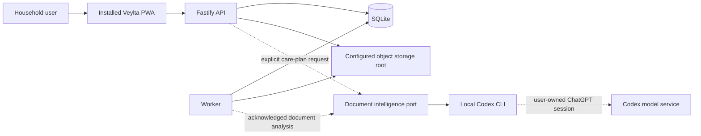
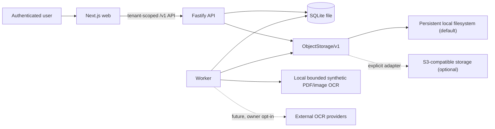

# Architecture

## Target architecture: home-server PWA

ADR 0007 establishes one household server as the authority boundary. SQLite is
the durable structured store, the configured object root holds immutable source
bytes, and the browser is an installable client rather than the data custodian.



The PWA owns presentation and human decisions. The API resolves the signed-in
account and authorizes every profile selector. Only an administrator, the
profile's linked user, or an explicitly granted actor may open a profile. The
Codex adapter never reads or stores Codex OAuth credentials. The settings API
reads the local app-server model catalog and rate-limit windows, then persists
one validated execution profile shared by document analysis, document dialogue,
and care-plan proposals.
Settings use `codex app-server daemon` only for local runtime status/control.
Acknowledged document jobs and care-plan requests run separate bounded
`codex exec --ephemeral` job in an empty read-only working directory, with
tools and user customizations disabled. Document analysis receives bounded page
content but no family/profile identifier, original filename, storage key, or
filesystem path. Care-plan generation still receives only the latest confirmed
summary projection.

`StorageController` is the single runtime port used by API and worker. Each
process loads the authoritative local root and generation from SQLite at start.
A cache miss checks the generation once, so an already-running worker observes
a verified administrator relocation without turning every object read into a
competing SQLite query. The previous root is retained for recovery; cleanup and
backup policy remain explicit operator work.

## Decision summary

Veylta uses a small TypeScript monorepo with three deployable processes:
a Next.js web application, a Fastify API, and a worker. Embedded SQLite through
Node.js `node:sqlite` stores accounts, domain state, explicit schema migrations,
audit events, and durable idempotent jobs. Original documents live behind versioned
`ObjectStorage/v1`; the default adapter uses a persistent local filesystem
directory, and an optional S3-compatible adapter preserves the same contract
for synthetic deployments.

The public document surface is `document/v5`: immutable extracted facts remain
separate from explicit, idempotent fact-review decisions. Each persisted decision
summary carries the deciding account and decision time; the immutable facts read
retains the extraction run and source version that supplied it. Together they let
a document workspace show a decision journal without changing raw evidence. The
workspace keeps warning-bearing facts out of bulk confirmation, pairs duplicate
generic/lab projections by exact source provenance, and binds a full-history
navigation to the selected canonical code. The
separate read-only
`observation-history/v1` boundary exposes only those immutable observations
that were explicitly confirmed or corrected. `indicator-series/v1` is a second
read boundary that groups only the deterministic synthetic canonical codes and
requires an exact source unit before it returns a comparable series.
`audit-log/v1` is a third, owner-only and payload-free boundary: it projects
only audit action/result/time/actor/resource selectors and never exposes event
metadata or medical/document payloads.
`health-summary/v1` is an immutable, post-review profile snapshot: it contains
only confirmed observations, source selectors, new-versus-carried evidence,
closed missing-context labels, and two operational next-action codes. It does
not calculate a diagnosis, triage, risk, red flag, trend, or treatment advice.
`health-summary-history/v1` is its separate read-only index: it exposes bounded
immutable version selectors newest-first and permits reopening one exact stored
snapshot, but never compares versions or derives a change.
`health-summary-comparison/v1` is an explicit read of two authorized immutable
snapshots. It returns only their source-set membership delta, and therefore
does not calculate values, direction, trend, diagnosis, or recommendation.
`home-care-plan/v1` is the profile-scoped household action boundary. It keeps
person-authored decisions separate from agent proposals. User actions have no
source provenance and begin accepted; an agent proposal must bind an immutable
health summary, rule version, optional included observation, and closed missing
context before it may be displayed. Only a person may move it from `proposed`
to `accepted` or `dismissed`.

The local synthetic demo additionally supports a one-time adult or caregiver
invitation. The code is returned only at issuance and stored only as a SHA-256
hash. Adult acceptance creates a self-linked adult profile; caregiver acceptance
creates no profile. An active owner may additionally create one explicit,
revocable `profile.read` grant to an active invited adult or caregiver for one
profile. Server-side authorization evaluates that grant on every read; it never
implies upload, extraction review, retry, invitations, or audit-log access. This
is not a production identity or full consent system.

The first vertical slice uses a deterministic, versioned parser for one
synthetic report grammar. PDF reads the text layer first and, only when that layer is
missing, applies bounded local English OCR to rendered PDF pages. Direct PNG/JPEG
checks the encoded header and pixels before the same local OCR and strict grammar
check. It does not invoke an external OCR provider or
an LLM. The optional S3 adapter is a storage boundary, not document egress to
an OCR/LLM provider; it remains disabled unless explicitly configured.

## System context



The browser never accesses the database or a storage path directly. The API
resolves the authenticated actor, checks family/profile scope server-side, and
then proxies authorized document downloads. Resource IDs are selectors, never
proof of authorization.

## Repository boundaries

The intended minimal layout is:

```text
apps/
  web/       # UI and browser integration; no medical domain rules
  api/       # Fastify HTTP entry, worker entry, and shared domain services
packages/
  contracts/ # versioned HTTP and extraction schemas
db/
  migrations/ # ordered, explicit SQLite migrations and rollback files
docs/
```

The API and worker are separate runtime entries from the same `apps/api`
artifact. No separate worker workspace or Nx/Turbo-style orchestration is
required. Shared code is extracted only when two real consumers need it.

## Runtime responsibilities

### Web

- Makes the active family member/profile unmistakable.
- Supports family/profile creation, document upload, immutable metadata,
  logical duplicate prevention, authorized source download under the original
  display filename, idempotent archive deletion, and real processing status.
- Searches the authorized profile archive through a bounded local projection of
  the latest Russian document summaries and structured source results.
- Presents generic document results (including genetic and categorical
  findings) as untrusted source-derived analytics with exact page/fragment
  provenance; it does not silently promote them into confirmed Observations.
- Polls the processing endpoint while work is active and presents only a
  sanitized failure category plus an authorized retry action.
- Presents source-first fact decisions and correction/confirmation, then a
  profile-wide confirmed-observation history with source document provenance.
- Reads `profile-overview/v1` after the same profile authorization and presents
  only bounded source/document/review state; it does not synthesize a clinical
  profile, score, diagnosis, or recommendation.
- Reads `health-summary/v1` after the same profile authorization. It renders a
  bounded immutable evidence snapshot, its missing-context labels, and
  re-authorized document selectors; it never synthesizes clinical advice.
- Reads `health-summary-history/v1` under the same profile authorization and
  lets a user reopen an immutable earlier source snapshot without calculating a
  version-to-version conclusion.
- On explicit request, reads `health-summary-comparison/v1` under the same
  authorization and shows only the source records added to or absent from the
  target snapshot, with re-authorized document selectors.
- Reads `home-care-plan/v1` under the same profile authorization. Granted
  readers see it read-only; administrators, owners, and self-linked adults may
  add human decisions, request an acknowledged Codex proposal, or explicitly
  accept/dismiss that proposal.
- Offers owner/self profile actors a direct local TAR download of no more than
  five synthetic sources plus a checksummed manifest. It is a bounded snapshot,
  not a backup, restore, or production export workflow.
- Offers the same stricter actor boundary a separately versioned
  `synthetic-profile-export/v1` TAR with every current source and confirmed
  observation for one profile. It rejects profiles beyond ten synthetic sources
  before emitting bytes; it remains a local artifact, not restore/backup logic.
- Lets only a family owner archive a non-last profile through an inline explicit
  confirmation and owner-only restore list. Archive hides the profile from
  active navigation and all source access; it never instructs the client to
  delete evidence or calls a backup/restore facility.
- Presents an authorized catalog of known synthetic indicators and, only for an
  exact code/unit series, a compact numeric chart and deterministic source-value
  difference. The timeline and source links remain available beside the chart.
- Treats API errors and authorization failures as data, with no domain state
  transitions hidden in React components.

### API

- Authenticates the actor and enforces tenant/profile authorization per request.
- Validates request schemas, MIME/type, size, state transitions, and ownership.
- Streams uploads through hashing and storage; never buffers a whole document.
- The checked-in fixture, tests, and parser format are synthetic-only. MIME,
  signature, and size checks are not a detector for real medical content, so
  local demo use remains explicitly unsuitable for real data.
- Creates document/idempotency rows and audit events transactionally, then
  creates a durable extraction job in the same upload transaction.
- Exposes tenant-scoped processing status and extracted facts; accepts a retry
  only for a terminal failed job, a fresh immutable restart only for a terminal
  latest job, and an explicit fact review only with exact `Origin` and
  `Idempotency-Key`.
- Persists one append-only Russian Codex dialogue per document. Each model turn
  receives a fresh capability-bound, read-only MCP context tool; the model
  cannot choose another tenant/profile/document or access SQLite, storage, or
  document bytes directly.
- Reads `observation-history/v1` only after profile authorization, uses opaque
  keyset pagination, and audits the payload-free history access. The returned
  source-document path remains a relative selector: the download endpoint
  performs authorization again.
- Reads `profile-overview/v1` in one profile-authorized transaction, returning
  only bounded recent document, unresolved-review, and confirmed-observation
  projections. The `profile.overview.opened` audit event stores only the
  versioned contract marker, never a filename, value, fragment, or cursor.
- Builds `synthetic-evidence-bundle/v1` only after the stricter owner/self
  profile boundary. It reads at most five current immutable sources through the
  expected checksum/size/content-type storage boundary, writes generated-safe
  archive paths, and records only the versioned payload-free export audit event.
- Supplies a local, read-only evidence-bundle verifier. It parses the bounded
  USTAR bytes in memory without extraction or API access, checks either local
  archive manifest and every source checksum/signature, and returns only safe
  aggregate counts.
- Reads `audit-log/v1` only after an active owner check on the requested family;
  it uses opaque keyset pagination, adds one payload-free access event per
  successful page, and does not expose audit metadata or correlation IDs.
- Proxies local document reads after authorization.

### Document agent runtime

- Uses the locally authenticated Codex CLI subscription and a persistent Codex
  thread ID; Veylta never reads, copies, or stores OAuth credentials or API
  keys.
- Runs from an empty temporary directory in the read-only sandbox with shell,
  browser, apps, plugins, memories, collaboration, computer use, and image
  generation disabled.
- Registers the official Model Context Protocol Streamable HTTP transport on a
  loopback endpoint. A 256-bit bearer capability is stored only as a hash in
  memory, expires within the bounded turn window, and is revoked when the CLI
  process exits.
- Exposes only `get_document_context` in Task 36. It re-authorizes the actor and
  exact server-derived scope on every call and returns bounded source-first
  projections, never credentials, storage keys, filesystem paths, or raw file
  bytes.
- Persists user/assistant messages and Codex model/runtime provenance in
  SQLite. The first frontend uses ordinary React state and HTTP; no LangGraph
  orchestration or chat-component framework is introduced.

### Worker

- Polls and claims SQLite-backed jobs with bounded leases and retry counters.
- Executes idempotent processing steps, records each attempt/error, and
  extracts text and facts for the supported deterministic format.
- Commits one payload-free audit outcome atomically with successful facts or a
  retry/dead-letter transition; stdout contains only a sanitized outcome.
- It does not create a confirmed `Observation`; only a user review can do that
  in the first slice.
- Exhausted Task 5 work moves to a visible dead-letter state.
- A user-requested restart creates another job/run/result chain. Latest-result
  projections move forward without deleting or rewriting prior provenance.
- Every real queue, claim, stage, completion, retry, and terminal-failure
  transition also appends one closed-code `ProcessingJobEvent`. The public
  journal exposes only code, attempt number, and timestamp; it is not stdout,
  model token streaming, prompt content, or chain-of-thought.

### SQLite

- Is the source of truth for structured state and, from Task 5, local job
  coordination. The default file is `.local/veylta.sqlite`.
- Uses the SQLite runtime built into Node.js; no database server, container, ORM,
  or additional runtime package is required.
- Enables foreign keys, a 5-second busy timeout, WAL journaling, and
  `synchronous=NORMAL` on every application connection.
- Serializes operations inside each process and starts write transactions with
  `BEGIN IMMEDIATE`, so concurrent writers resolve before domain work proceeds.
- Uses ordered SQL migrations checked into source control. Every migration is
  reversible or includes an explicit, tested rollback procedure.
- Enforces tenant keys, foreign keys, uniqueness/idempotency keys, and valid
  status values in addition to application validation.

This is a local, single-host boundary. Multi-host API/worker replicas and high
write concurrency require a separate persistence ADR rather than placing the
SQLite file on a shared network filesystem.

## Upload and extraction flow

```mermaid
sequenceDiagram
  participant B as Browser
  participant A as API
  participant S as ObjectStorage/v1 local
  participant D as SQLite
  participant W as Worker
  participant C as Codex provider

  B->>A: POST synthetic PDF, PNG, or JPEG for patient profile
  A->>A: Authenticate, authorize, validate limits/signature
  A->>S: putStream(staging key) while calculating SHA-256
  A->>D: BEGIN IMMEDIATE; recheck idempotency/blob
  A->>S: Finalize deterministic immutable tenant-scoped blob
  A->>D: Reuse an active profile document, or insert document/version + audit + idempotency + extraction job; COMMIT
  A-->>B: 200 existing document, or 202 uploaded / processing queued
  W->>D: Claim durable job lease
  W->>S: getStream(document version)
  W->>W: Extract bounded page evidence
  W->>C: Classify + summarize + source-bound extraction (closed schema)
  C-->>W: Russian summaries + generic results + quantitative facts with exact fragments
  W->>W: Fail-closed schema and provenance validation
  W->>D: Transaction: pages + intelligence + run + immutable facts
  W-->>D: job succeeded; run awaiting_review
  B->>A: GET processing / facts
  Note over B,D: Explicit review decisions create optional observations; history re-authorizes every source link
```

When an owner archives a profile, the API transaction sets only
`patient_profiles.archived_at` and appends a payload-free audit event. Every
profile/document authorization query requires an active profile; candidate job
claims and the worker source lookup apply the same predicate. A completion
rechecks the predicate inside its write transaction, so an archive racing an
in-flight worker cannot append pages, facts, or a successful job outcome after
the profile becomes inactive. Restore clears only that timestamp; durable,
unmodified queued work becomes eligible again.

The storage/database boundary cannot provide a single distributed transaction.
The upload path therefore stages and validates the stream, enters an SQLite
`BEGIN IMMEDIATE` write transaction, rechecks request/blob state, finalizes the
stream under a deterministic tenant/checksum key, verifies immutable metadata,
and only then inserts the document/version/idempotency/audit rows and commits. A
rollback can leave an inaccessible final orphan, but cannot leave committed
metadata pointing to unavailable bytes. Retrying the same content safely reuses
the final object. Automated orphan retention and permanent deletion are
separate confirmed workflows and remain deferred.

## Idempotency and consistency

- Upload request idempotency is scoped by family and actor.
- Duplicate detection uses `(family_id, sha256)` so one tenant cannot learn that
  another tenant already has identical bytes.
- Each job has a stable deduplication key, attempt count, bounded lease, retry
  schedule, and terminal `dead_letter` state. A retry request is itself
  immutable and idempotency-scoped to the family and actor.
- Extraction output is unique by extraction run, parser version, source
  location, and fact key.
- Each fact has at most one immutable `ReviewDecision`. `ReviewRequest` scopes
  an idempotency key to family and actor, so an exact replay returns the prior
  response and a conflicting reuse fails deterministically.
- `confirm` and `correct` create one confirmed `Observation` per reviewed fact;
  `reject` creates none. The decision, optional observation and source range,
  idempotency request, and audit event commit in one database transaction.
- The raw extracted fact is never changed. Once every fact in an
  `awaiting_review` run has its final decision, that run becomes `completed`.
- `observation-history/v1` reads confirmed observations only, orders by the
  deterministic sample/result/upload timeline with an ID tie-breaker, and does
  not derive clinical interpretations. `indicator-series/v1` separately admits
  only explicitly known synthetic canonical codes and one exact source unit;
  its comparison is arithmetic on the latest two finite decimal source strings,
  with an explicit insufficient/unavailable state for every other case.
- A terminal worker outcome is committed with its fact graph or failure
  transition and is not duplicated by acknowledgement replay.
- State transitions are compare-and-set operations; retries cannot move a newer
  state backward.

## Document storage boundary

`ObjectStorage/v1` provides streaming writes, bounded verified reads, existence,
metadata, size, content type, checksum, and an explicit deletion primitive
reachable only from a separate confirmed deletion workflow. The upload path streams
uploads, but a controlled read takes a checksum-verified in-memory snapshot of
at most 5 MiB so the returned bytes are exactly the bytes that were verified.
Original `DocumentVersion` content is immutable after finalization.

The local adapter stores opaque keys derived from trusted identifiers/checksum,
not user filenames, under a configured persistent root. Reads cannot escape
that root. The API proxies downloads. The optional S3-compatible adapter maps
each opaque key to a provider-side digest (including key-binding metadata),
stages before finalizing with a
conditional create, and requires/attests SSE-S3 or SSE-KMS on every stored
object. Its controlled reads pin ETag and checksum-verify a bounded snapshot
against database metadata. Short-lived presigned URLs remain deferred.

## Medical data boundary

`ExtractedFact` records untrusted parser output and provenance. It is never an
asserted clinical fact. An immutable `ReviewDecision` records the explicit
`confirm`, `correct`, or `reject` outcome without changing that evidence.
Confirmation or correction creates an immutable `Observation` that retains
source value/unit separately from any normalized value/unit; rejection creates
no observation. Unit conversion is a versioned, reproducible operation and
never overwrites source data. See [ADR 0003](adr/0003-medical-data-model.md).

## Authentication and tenant isolation

The authentication mechanism may evolve, but every request must resolve a
server-side `actorUserId`. Authorization then checks:

1. active `FamilyMembership` and role;
2. requested `familyId` matches the resource's family;
3. the actor owns the profile, manages their self-linked profile, or holds the
   valid capability required for the requested operation;
4. the operation is allowed in the current resource state.

An archived profile is not an active resource state for profile, document,
history, export, or worker processing. Archive and restore require the owner
role, use the trusted Origin mutation gate, and write payload-free audits.

Queries include the authorized family boundary at their root. Cross-family and
otherwise inaccessible resource IDs return `404` to avoid existence disclosure.
Audit records contain actor, tenant, action, resource identifier, result, and
time, but not document bodies or medical values. The worker's structured logs
contain only its processing outcome and a sanitized error category; they omit
job identifiers, filenames, text, values, and stack traces.

## Observability

- Structured logs use request/job correlation IDs and redact bodies, extracted
  text, medical values, filenames, credentials, and signed links.
- Metrics report counts, durations, retries, dead-letter jobs, and state ages
  without patient labels or medical payloads.
- Traces propagate correlation metadata, never document content.
- Extraction/agent runs retain version, parameters, timing, and status. Future
  paid providers also record cost, but not secrets.

## Evolution boundaries

- Add an S3 adapter without changing domain code or HTTP semantics.
- Add OCR behind a versioned provider contract only after document security
  checks and explicit owner egress configuration.
- Add LLM providers behind independent adapters; route all inputs/outputs through
  deterministic pre/post safety rules and strict versioned schemas.
- Add FHIR R4 mapping at import/export edges. The internal model remains compact
  and FHIR-inspired rather than depending on a heavy FHIR platform.

## Deployment and readiness

The first slice is a synthetic, local-development demonstration. Production use
with real medical data additionally requires completed secret management,
transport and disk encryption, malware strategy, rate/size limits, backup and
restore testing, controlled export/deletion, incident response, privacy review,
and independent security/legal audits. No compliance claim follows from this
architecture.
