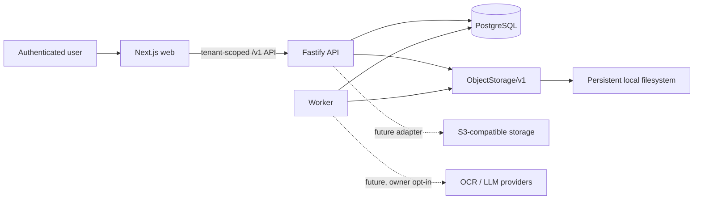
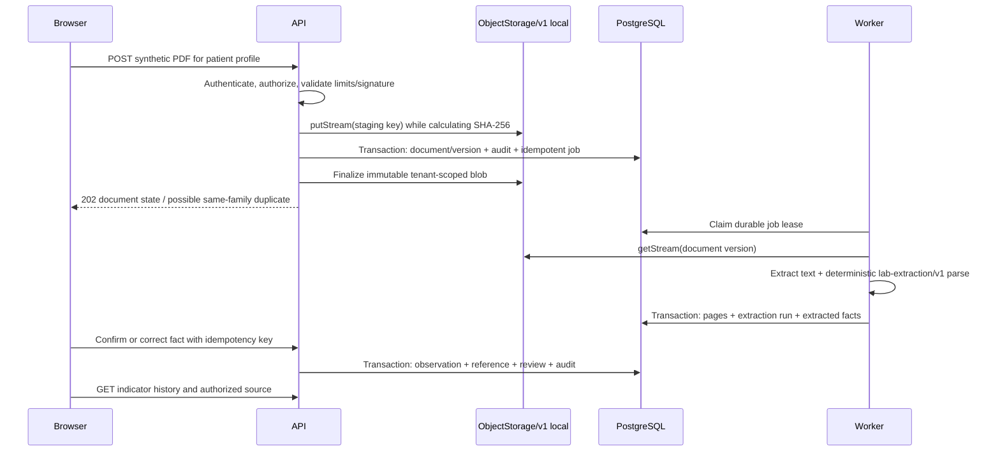

# Architecture

## Decision summary

Family Health uses a small TypeScript monorepo with three deployable processes:
a Next.js web application, a Fastify API, and a worker. PostgreSQL stores domain
state, explicit schema migrations, audit events, and durable idempotent jobs.
Original documents live behind versioned `ObjectStorage/v1`; the first adapter
uses a persistent local filesystem directory.

The first vertical slice uses a deterministic, versioned parser for one
synthetic PDF format with a text layer. It does not invoke OCR, an LLM, or a
cloud service. S3, OCR, and LLM providers remain adapter-level future work.

## System context



The browser never accesses the database or a storage path directly. The API
resolves the authenticated actor, checks family/profile scope server-side, and
then proxies authorized document downloads. Resource IDs are selectors, never
proof of authorization.

## Repository boundaries

The intended minimal layout is:

```text
apps/
  web/       # UI and browser integration; no medical domain rules
  api/       # Fastify HTTP entry, worker entry, and shared domain services
packages/
  contracts/ # versioned HTTP and extraction schemas
db/
  migrations/ # ordered, explicit PostgreSQL migrations and rollback notes
docs/
```

The API and worker are separate runtime entries from the same `apps/api`
artifact. No separate worker workspace or Nx/Turbo-style orchestration is
required. Shared code is extracted only when two real consumers need it.

## Runtime responsibilities

### Web

- Makes the active family member/profile unmistakable.
- Supports family/profile creation, document upload, processing state, review,
  correction/confirmation, indicator history, and source inspection.
- Treats API errors and authorization failures as data, with no domain state
  transitions hidden in React components.

### API

- Authenticates the actor and enforces tenant/profile authorization per request.
- Validates request schemas, MIME/type, size, state transitions, and ownership.
- Streams uploads through hashing and storage; never buffers a whole document.
- Creates domain rows, durable jobs, and audit events transactionally.
- Proxies local document reads after authorization.

### Worker

- Claims Postgres-backed jobs with bounded leases and retry counters.
- Executes idempotent processing steps and records each attempt and error.
- Extracts text and facts for the supported deterministic format.
- Does not create a confirmed `Observation`; only a user review can do that in
  the first slice.
- Moves exhausted work to a visible dead-letter state.

### PostgreSQL

- Is the source of truth for structured state and job coordination.
- Uses ordered SQL migrations checked into source control. Every migration is
  reversible or includes an explicit, tested rollback procedure.
- Enforces tenant keys, foreign keys, uniqueness/idempotency keys, and valid
  status values in addition to application validation.

## Upload and extraction flow



The storage/database boundary cannot provide a single distributed transaction.
The implementation therefore uses staging/finalization and explicit recovery:
an unreferenced staged blob is safe to garbage-collect after a retention window;
a committed version whose finalization failed is visibly failed/retryable, not
silently accepted. Automatic permanent deletion is not part of this workflow.

## Idempotency and consistency

- Upload request idempotency is scoped by family and actor.
- Duplicate detection uses `(family_id, sha256)` so one tenant cannot learn that
  another tenant already has identical bytes.
- Each job has a stable deduplication key, step name, attempt count, lease,
  retry schedule, and terminal `dead_letter` state.
- Extraction output is unique by extraction run, parser version, source
  location, and fact key.
- Observation creation is unique per reviewed extracted fact. A repeated
  confirmation returns the existing result or a deterministic conflict.
- Medical rows and their audit event commit in one database transaction.
- State transitions are compare-and-set operations; retries cannot move a newer
  state backward.

## Document storage boundary

`ObjectStorage/v1` provides streaming write/read, existence, metadata, size,
content type, checksum, and an explicit deletion primitive reachable only from
a separate confirmed deletion workflow. Original `DocumentVersion` content is
immutable after finalization.

The local adapter stores opaque keys derived from trusted identifiers/checksum,
not user filenames, under a configured persistent root. Reads cannot escape
that root. The API proxies downloads for the first slice. S3-compatible storage,
provider-side encryption, and short-lived presigned URLs are deferred to the
next storage slice and must satisfy the same contract tests.

## Medical data boundary

`ExtractedFact` records untrusted parser output and provenance. It is never an
asserted clinical fact. Human review creates an immutable `Observation` that
retains source value/unit separately from any normalized value/unit. Unit
conversion is a versioned, reproducible operation and never overwrites source
data. See [ADR 0003](adr/0003-medical-data-model.md).

## Authentication and tenant isolation

The authentication mechanism may evolve, but every request must resolve a
server-side `actorUserId`. Authorization then checks:

1. active `FamilyMembership` and role;
2. requested `familyId` matches the resource's family;
3. the actor owns the profile or has a valid `ConsentGrant` for the capability;
4. the operation is allowed in the current resource state.

Queries include the authorized family boundary at their root. Cross-family and
otherwise inaccessible resource IDs return `404` to avoid existence disclosure.
Audit records contain actor, tenant, action, resource identifier, result, and
time, but not document bodies or medical values.

## Observability

- Structured logs use request/job correlation IDs and redact bodies, extracted
  text, medical values, filenames, credentials, and signed links.
- Metrics report counts, durations, retries, dead-letter jobs, and state ages
  without patient labels or medical payloads.
- Traces propagate correlation metadata, never document content.
- Extraction/agent runs retain version, parameters, timing, and status. Future
  paid providers also record cost, but not secrets.

## Evolution boundaries

- Add an S3 adapter without changing domain code or HTTP semantics.
- Add OCR behind a versioned provider contract only after document security
  checks and explicit owner egress configuration.
- Add LLM providers behind independent adapters; route all inputs/outputs through
  deterministic pre/post safety rules and strict versioned schemas.
- Add FHIR R4 mapping at import/export edges. The internal model remains compact
  and FHIR-inspired rather than depending on a heavy FHIR platform.

## Deployment and readiness

The first slice is a synthetic, local-development demonstration. Production use
with real medical data additionally requires completed secret management,
transport and disk encryption, malware strategy, rate/size limits, backup and
restore testing, controlled export/deletion, incident response, privacy review,
and independent security/legal audits. No compliance claim follows from this
architecture.
