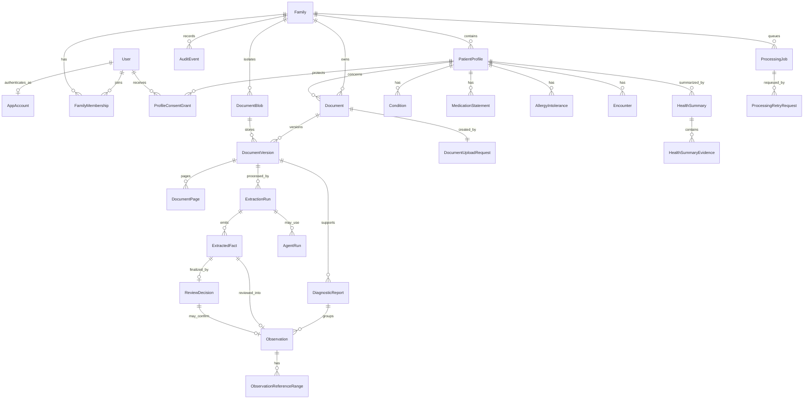

# ER model

## Modeling rules

- `Family` is the tenant boundary. Tenant-owned rows carry `family_id` directly
  even when it can be reached through another relation, so authorization and
  database constraints do not depend on an unscoped lookup.
- Identifiers are opaque and globally unique; they never grant access.
- Time is stored with timezone. Medical dates with different meanings are
  separate fields, not one generic date.
- Source values and units are immutable strings. Optional normalized values and
  units live beside them and identify the conversion version.
- Extracted facts are untrusted proposals. Only an explicit review creates a
  confirmed observation.
- Originals, extraction runs, facts, review decisions, observations, and audit
  events are append-oriented. A correction records corrected source fields in a
  final decision without editing the extraction.
- All status columns are constrained enums; all relationships use foreign keys.

## Logical model

`ProfileConsentGrant` and Task 20 `HealthSummary` are current narrow migrated
boundaries. Extended clinical resources, `Recommendation`, broader consent
capabilities, and live `AgentRun` providers remain designed boundaries, not a
claim that they are migrated in the first slice.

## Identity and access

### User

- `id`
- display name
- `created_at`, `disabled_at`

### AppAccount

- `user_id` (one-to-one with `User`)
- normalized, case-insensitive `username`
- versioned salted scrypt `password_hash`
- system `role`: `admin | user`
- `created_at`, `updated_at`

An empty installation creates the first `admin` account exactly once. Passwords
and Codex credentials are never stored in `User`, `Session`, or audit metadata.

### Session

- `id`, `user_id`
- SHA-256 token digest (never the plaintext cookie value)
- `created_at`, `expires_at`, `revoked_at`

The local browser token is an HttpOnly, SameSite cookie. Local account sign-in
is delivered; rotation policy, password recovery, passkeys, and remote-deployment
controls remain deferred.

### HomeStorageSettings

- singleton installation row
- `driver`: `local | s3`
- `current_root`, guarded `target_root`
- relocation `state`: `stable | copying | failed`
- monotonic `generation`, sanitized `last_failure_code`, `updated_at`

The row contains configuration, never document bytes or credentials. Only an
administrator projection may read an absolute local path. API and worker resolve
the same row through `StorageController`.

### Family

- `id`, `display_name`
- `created_by_user_id`, `created_at`
- future storage/provider policy references

### FamilyMembership

- `id`, `family_id`, `user_id`
- `role`: `owner | adult_member | caregiver`
- `status`: `active | revoked`
- `created_at`, `revoked_at`

Unique active membership per `(family_id, user_id)`. Membership does not imply
access to every profile.

### FamilyInvitation

- `id`, `family_id`, `issued_by_user_id`, SHA-256 `token_hash`
- fixed `adult_member | caregiver` role, `expires_at`, optional `accepted_by_user_id` /
  `accepted_at`, `created_at`

The local-demo token is returned only when created, is single-use, and never
becomes a stored plaintext credential. Database triggers restrict issuance to
an active owner and make its identity/token/expiry fields immutable. Accepting
an adult invitation creates a linked adult profile; accepting a caregiver
invitation creates no profile and no access to another profile.

### PatientProfile

- `id`, `family_id`, `display_name`
- `kind`: `adult | dependent`
- optional linked `user_id` for a self-managed adult
- `created_by_user_id`, `created_at`, `archived_at`

The first slice needs owner-created profiles. Broader demographic/clinical data
is added only when a real use case needs it.

`archived_at` is the current reversible archive state. Only a family owner can
set or clear it through the audited `profile-archive/v1` routes; the last active
profile cannot be archived. Active authorization and worker claims require it
to be null, while documents, blobs, raw facts, observations, jobs, and audits
remain immutable and retained. It is not a deletion, backup, or restore model.

### ProfileConsentGrant

- `id`, `family_id`, `patient_profile_id`
- `grantee_user_id`, `granted_by_user_id`
- fixed `profile.read` capability, `created_at`, optional `revoked_at`

The current synthetic-demo grant is issued only by an active owner to an active
`adult_member` or `caregiver`, has one active capability per profile/member,
and is immutable except for a one-way revoke. A caregiver may never be linked
to an adult profile. The grant is evaluated on every profile/document/history
read and never grants upload, review, retry, invitations, or audit-log access.
Broader capability sets, expiry, and delegation remain deferred.

## Documents and processing

### Document

- `id`, `family_id`, `patient_profile_id`
- user-facing title and original filename as untrusted display metadata
- `status`, `uploaded_by_user_id`, `uploaded_at`
- optional `duplicate_of_document_id`, scoped to the same family

`Document` is the stable logical record. It does not contain blob bytes. Its
immutable document status remains `uploaded`; Task 5 processing state belongs to
the linked `ProcessingJob` and selected `ExtractionRun`, so the document itself
does not pretend that an unreviewed extraction is a confirmed medical result.

### DocumentVersion

- `id`, `family_id`, `document_id`, `version_number`
- `created_at`

Unique `(document_id, version_number)`; it references one tenant-matched
`DocumentBlob` and never duplicates physical metadata.

### DocumentBlob

- `id`, `family_id`
- `storage_contract_version`, opaque `storage_key`
- trusted `content_type`, `byte_size`, `sha256`, `created_at`

Unique `(family_id, sha256)` means same-family uploads share immutable physical
bytes while different families never share a blob or a duplicate oracle. A row
is inserted only after the final object is available and verified.

`DocumentBlobContentType` is the immutable content-type sidecar introduced by
the direct-image migration. Historic `DocumentBlob` rows retain their
PDF-only storage constraint; PDF uses that value and direct PNG/JPEG rows use
the same-family sidecar value. This preserves migration rollback safety without
rewriting accepted source evidence.

### DocumentUploadRequest

- `id`, `family_id`, `actor_user_id`, `patient_profile_id`, `document_id`
- SHA-256 digest of the 16–200 character idempotency key
- request checksum, content type, byte size, and `created_at`

Unique `(family_id, actor_user_id, idempotency_key_hash)` makes equivalent
replays return the first document and conflicting reuses fail deterministically.

`DocumentUploadRequestContentType` applies the same immutable sidecar pattern
to a direct PNG/JPEG request, so a replay reconstructs the exact response MIME
type without treating the display filename as evidence.

### DocumentPage

- `id`, `family_id`, `document_version_id`, `page_number`
- extracted text or a reference to a derived text artifact
- extraction method/version and checksum
- `created_at`

Unique `(document_version_id, page_number)`. Page text is sensitive medical data
and must not enter general logs.

### ExtractionRun

- `id`, `family_id`, `document_version_id`
- `extractor_kind`, `extractor_version`, `output_schema_version`
- `status`: `queued | running | awaiting_review | completed | failed`
- `started_at`, `completed_at`, structured validation/error metadata

A stable idempotency key prevents the same extractor/version from creating a
second active result for one document version.

Task 5 creates an `awaiting_review` run only after page and fact provenance has
been stored in the same transaction. Task 6 changes that run to `completed`
only after every fact has one final `ReviewDecision`; parsing alone never emits
`completed`.

### ExtractedFact

- `id`, `family_id`, `extraction_run_id`, `document_page_id`
- stable `fact_key`, `source_fragment`, optional source coordinates
- `source_name`, `source_value`, `source_unit`
- proposed canonical code/value/unit and reference-range fields
- proposed specimen/sample/result/laboratory fields
- `confidence`, validation issues
- stored `review_status`: `extracted | needs_review`
- `created_at`

Raw parser output is immutable. Review decisions refer to the fact rather than
editing it. The public facts read derives `confirmed` for `confirm`/`correct`
and `rejected` for `reject`; it leaves the stored raw status unchanged.

### ReviewDecision

- `id`, `family_id`, `extracted_fact_id`, `source_fact_version`
- `outcome`: `confirm | correct | reject`
- optional corrected source name/value/unit, required only for `correct`
- optional `observation_id`; required for `confirm`/`correct` and absent for
  `reject`
- `decided_by_user_id`, `decided_at`, `created_at`

Unique `(family_id, extracted_fact_id)` permits one immutable final decision
per fact. A confirm or correction is linked to one confirmed `Observation`; a
rejection has none. No review decision or raw fact can be updated or deleted.

### ReviewRequest

- `id`, `family_id`, `actor_user_id`, `extracted_fact_id`, `review_decision_id`
- SHA-256 digests of the `Idempotency-Key` and canonical command
- `created_at`

This immutable request record is unique by family, actor, and idempotency-key
digest. It enables an exact replay to return the original review response and
makes conflicting key reuse fail without creating another decision.

### ProcessingJob

- `id`, `family_id`, `kind`, `dedupe_key`, `payload_version`
- `state`: `pending | leased | retry_wait | succeeded | dead_letter`
- `current_stage`: `security_check | text_extraction | document_classification |
  structured_extraction | validation` while leased
- `attempt_count`, `max_attempts`, `available_at`
- `lease_owner`, `lease_expires_at`, sanitized last-error fields
- `created_at`, `updated_at`

Unique `(kind, dedupe_key)`. Payload contains identifiers, not document bytes or
medical text.

### ProcessingRetryRequest

- `id`, `family_id`, `actor_user_id`, `document_version_id`, `processing_job_id`
- SHA-256 digest of the retry `Idempotency-Key`, `created_at`

It is append-only and accepts an insert only while its tenant-scoped job is in
`dead_letter`. More than one terminal cycle may have a distinct manual requeue;
the actor/key uniqueness makes an equivalent browser replay return the original
accepted retry rather than creating new work.

## Confirmed medical record

### DiagnosticReport

- `id`, `family_id`, `patient_profile_id`, `document_version_id`
- source title/status and medically distinct dates
- laboratory and provenance metadata

This groups observations from one report. Its persistence can follow the first
fact-confirmation path if the slice does not yet need report-level behavior.

### Observation

- `id`, `family_id`, `patient_profile_id`
- optional `diagnostic_report_id`; required `source_extracted_fact_id`
- required `review_decision_id`, `source_fact_version`
- canonical code and source name exactly as reported
- immutable `source_value`, `source_unit`
- optional `normalized_value`, `normalized_unit`, `conversion_version`
- separate `sampled_at`, `resulted_at`, `uploaded_at`
- optional specimen type and laboratory
- `document_version_id`, `document_page_id`, `source_fragment`
- extraction confidence
- `status`: `confirmed`; a rejection is represented only by its
  `ReviewDecision`, not by an observation row
- `confirmed_by_user_id`, `confirmed_at`, `created_at`

Unique `source_extracted_fact_id` and `review_decision_id` enforce one
confirmed observation for one confirming/correcting decision. A correction
uses its corrected source fields for that observation while preserving the raw
fact and its provenance.

### ObservationReferenceRange

- `id`, `family_id`, `observation_id`
- raw low/high/text/unit as printed by the source
- optional normalized low/high/unit and conversion version
- laboratory out-of-range flag and applicability metadata

Ranges remain attached to their source observation; they are not treated as a
universal canonical range.

### Condition, MedicationStatement, AllergyIntolerance, Encounter

Each is tenant/profile scoped, status-bearing, source/provenance linked, and
append-oriented. Their detailed schemas are deferred until a vertical slice
uses them; the first slice must not create speculative empty physical tables.

### HealthSummary

Task 20 persists an immutable, versioned `HealthSummary` and ordered
`HealthSummaryEvidence` snapshot for one patient profile. Evidence may point
only to a confirmed `Observation`; each entry records whether it is new since
the preceding summary. The summary's JSON metadata is closed to bounded
missing-context labels and the two non-clinical actions `prepare_source_for_clinician`
and `complete_pending_review`. It has no diagnosis, risk, red-flag,
interpretation, or treatment-advice field.

Task 21 adds no table or mutable projection: `health-summary-history/v1` is a
profile-authorized, newest-first index over those existing immutable summary
rows. Its version selector only reopens the exact `HealthSummary` evidence
snapshot; it neither computes nor persists a comparison between versions.

Task 22 likewise adds no table: `health-summary-comparison/v1` reads two
authorized immutable snapshots and compares membership of their existing
`HealthSummaryEvidence` links. It is not a value comparison and cannot persist
or imply a health interpretation.

`Recommendation` remains deferred until a separately reviewed deterministic
safety boundary can distinguish facts, assumptions, advice, red flags,
confidence, missing data, and evidence links.

### AgentRun

- tenant, patient profile, purpose, status
- provider/model and prompt/input/output schema versions
- sanitized parameters, timing, cost, error category
- evidence links and safety-policy version

No prompt/model run exists in the deterministic first slice. `ExtractionRun`
still records its parser/schema version and timing.

### AuditEvent

- `id`, `family_id`, `actor_user_id`
- `action`, `resource_type`, `resource_id`, `result`
- request/job correlation ID, timestamp, minimal non-medical metadata

The physical SQLite subset makes audit events append-only: `UPDATE` and
`DELETE` are rejected by triggers. Owner-only `audit-log/v1` projects just the
event id, action, result, timestamp, actor, and resource selector; correlation
and metadata stay internal.

Audit events must not copy document bytes, page text, source fragments, values,
units, secrets, session tokens, or signed URLs.

## First-slice physical subset

SQLite migrations create only rows required by executable behavior:

- `User`, `Session`, `Family`, `FamilyMembership`, `PatientProfile`;
- `Document`, `DocumentBlob`, `DocumentVersion`, `DocumentUploadRequest`;
- `AuditEvent`.

Task 5 adds `DocumentPage`, `ExtractionRun`, `ExtractedFact`, `ProcessingJob`,
and `ProcessingRetryRequest`. Task 6 adds `ReviewDecision`, `ReviewRequest`,
`Observation`, and `ObservationReferenceRange`. Task 7 adds no speculative
tables: `observation-history/v1` is an authorized profile-scoped read over
confirmed `Observation` rows, their optional source range, reviewer, and
document/page provenance. Task 20 adds only `HealthSummary` and
`HealthSummaryEvidence`, used by `health-summary/v1` and its Task 21 immutable
version index. Add broader consent
capabilities, extended clinical entities, recommendations, and agent runs only
with the slice that uses and tests them.

## Database invariants to test

- Foreign keys cannot cross family boundaries; use composite tenant-aware keys
  where needed.
- A worker cannot claim or persist a job under a different family.
- A worker cannot claim or persist extraction output for an archived profile;
  restoring only its `archived_at` makes its existing durable job eligible again.
- One available document version maps to one immutable storage key/checksum.
- Job and extraction dedupe constraints survive concurrent retries.
- One extracted fact has one immutable final review decision and cannot create
  duplicate observations.
- Confirmation/correction creates its decision, observation, optional range,
  idempotency request, and audit event atomically; rejection creates no
  observation.
- The raw extraction status and values cannot be changed by review.
- Original and normalized values can coexist; neither can overwrite the other.
