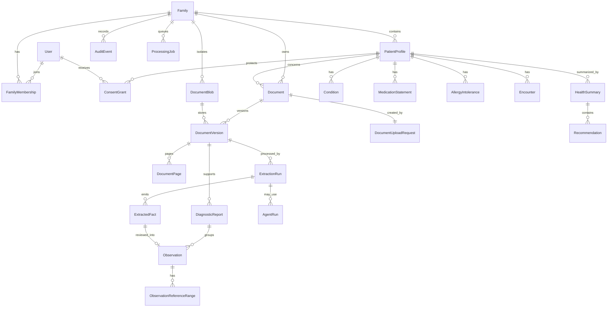

# ER model

## Modeling rules

- `Family` is the tenant boundary. Tenant-owned rows carry `family_id` directly
  even when it can be reached through another relation, so authorization and
  database constraints do not depend on an unscoped lookup.
- Identifiers are opaque and globally unique; they never grant access.
- Time is stored with timezone. Medical dates with different meanings are
  separate fields, not one generic date.
- Source values and units are immutable strings. Optional normalized values and
  units live beside them and identify the conversion version.
- Extracted facts are untrusted proposals. Only an explicit review creates a
  confirmed observation.
- Originals, extraction runs, facts, review decisions, observations, and audit
  events are append-oriented. Corrections preserve history.
- All status columns are constrained enums; all relationships use foreign keys.

## Logical model

`ConsentGrant`, the extended clinical resources, `HealthSummary`,
`Recommendation`, and live `AgentRun` providers are designed boundaries, not a
claim that they are migrated in the first slice.

## Identity and access

### User

- `id`
- display name; production login identity remains owned by a future
  authentication subsystem
- `created_at`, `disabled_at`

Task 3 creates an opaque local demo identity and stores no email or reusable
credential in the domain table.

### Session

- `id`, `user_id`
- SHA-256 token digest (never the plaintext cookie value)
- `created_at`, `expires_at`, `revoked_at`

The local browser token is an HttpOnly, SameSite cookie. Production identity,
rotation, recovery, and deployment controls are intentionally deferred.

### Family

- `id`, `display_name`
- `created_by_user_id`, `created_at`
- future storage/provider policy references

### FamilyMembership

- `id`, `family_id`, `user_id`
- `role`: `owner | adult_member | caregiver`
- `status`: `active | revoked`
- `created_at`, `revoked_at`

Unique active membership per `(family_id, user_id)`. Membership does not imply
access to every profile.

### PatientProfile

- `id`, `family_id`, `display_name`
- `kind`: `adult | dependent`
- optional linked `user_id` for a self-managed adult
- `created_by_user_id`, `created_at`, `archived_at`

The first slice needs owner-created profiles. Broader demographic/clinical data
is added only when a real use case needs it.

### ConsentGrant

- `id`, `family_id`, `patient_profile_id`
- `grantee_user_id`, `granted_by_user_id`
- versioned capability set, for example read/review/share
- `starts_at`, `expires_at`, `revoked_at`, `created_at`

Grant evaluation is default-deny. A caregiver never receives access merely by
joining a family.

## Documents and processing

### Document

- `id`, `family_id`, `patient_profile_id`
- user-facing title and original filename as untrusted display metadata
- `status`, `uploaded_by_user_id`, `uploaded_at`
- optional `duplicate_of_document_id`, scoped to the same family

`Document` is the stable logical record. It does not contain blob bytes.
Task 4 constrains `status` to `uploaded`; later tasks must migrate the constraint
and public contract only when another processing state is actually implemented.

### DocumentVersion

- `id`, `family_id`, `document_id`, `version_number`
- `created_at`

Unique `(document_id, version_number)`; it references one tenant-matched
`DocumentBlob` and never duplicates physical metadata.

### DocumentBlob

- `id`, `family_id`
- `storage_contract_version`, opaque `storage_key`
- trusted `content_type`, `byte_size`, `sha256`, `created_at`

Unique `(family_id, sha256)` means same-family uploads share immutable physical
bytes while different families never share a blob or a duplicate oracle. A row
is inserted only after the final object is available and verified.

### DocumentUploadRequest

- `id`, `family_id`, `actor_user_id`, `patient_profile_id`, `document_id`
- SHA-256 digest of the 16–200 character idempotency key
- request checksum, content type, byte size, and `created_at`

Unique `(family_id, actor_user_id, idempotency_key_hash)` makes equivalent
replays return the first document and conflicting reuses fail deterministically.

### DocumentPage

- `id`, `family_id`, `document_version_id`, `page_number`
- extracted text or a reference to a derived text artifact
- extraction method/version and checksum
- `created_at`

Unique `(document_version_id, page_number)`. Page text is sensitive medical data
and must not enter general logs.

### ExtractionRun

- `id`, `family_id`, `document_version_id`
- `extractor_kind`, `extractor_version`, `output_schema_version`
- `status`: `queued | running | awaiting_review | completed | failed`
- `started_at`, `completed_at`, structured validation/error metadata

A stable idempotency key prevents the same extractor/version from creating a
second active result for one document version.

### ExtractedFact

- `id`, `family_id`, `extraction_run_id`, `document_page_id`
- stable `fact_key`, `source_fragment`, optional source coordinates
- `source_name`, `source_value`, `source_unit`
- proposed canonical code/value/unit and reference-range fields
- proposed specimen/sample/result/laboratory fields
- `confidence`, validation issues
- `review_status`: `extracted | needs_review | confirmed | rejected`
- `created_at`

Raw parser output is immutable. Review decisions refer to the fact rather than
editing it.

### ProcessingJob

- `id`, `family_id`, `kind`, `dedupe_key`, `payload_version`
- `state`: `pending | leased | retry_wait | succeeded | dead_letter`
- `attempt_count`, `max_attempts`, `available_at`
- `lease_owner`, `lease_expires_at`, sanitized last-error fields
- `created_at`, `updated_at`

Unique `(kind, dedupe_key)`. Payload contains identifiers, not document bytes or
medical text.

## Confirmed medical record

### DiagnosticReport

- `id`, `family_id`, `patient_profile_id`, `document_version_id`
- source title/status and medically distinct dates
- laboratory and provenance metadata

This groups observations from one report. Its persistence can follow the first
fact-confirmation path if the slice does not yet need report-level behavior.

### Observation

- `id`, `family_id`, `patient_profile_id`
- optional `diagnostic_report_id`; required `source_extracted_fact_id`
- canonical code and source name exactly as reported
- immutable `source_value`, `source_unit`
- optional `normalized_value`, `normalized_unit`, `conversion_version`
- separate `sampled_at`, `resulted_at`, `uploaded_at`
- optional specimen type and laboratory
- `document_version_id`, `document_page_id`, `source_fragment`
- extraction confidence
- `status`: `confirmed | rejected` for persisted review outcomes; upstream
  extraction statuses remain on `ExtractedFact`
- `confirmed_by_user_id`, `confirmed_at`, `created_at`

Unique `source_extracted_fact_id` for the first-slice confirmation path. A
correction creates an explicit decision/new derived output while preserving the
fact and prior audit history.

### ObservationReferenceRange

- `id`, `family_id`, `observation_id`
- raw low/high/text/unit as printed by the source
- optional normalized low/high/unit and conversion version
- laboratory out-of-range flag and applicability metadata

Ranges remain attached to their source observation; they are not treated as a
universal canonical range.

### Condition, MedicationStatement, AllergyIntolerance, Encounter

Each is tenant/profile scoped, status-bearing, source/provenance linked, and
append-oriented. Their detailed schemas are deferred until a vertical slice
uses them; the first slice must not create speculative empty physical tables.

### HealthSummary and Recommendation

`HealthSummary` is versioned for a patient profile and identifies which new
confirmed data changed it. `Recommendation` distinguishes facts, assumptions,
advice, red flags, confidence, missing data, and evidence links. Both are
deferred until deterministic safety and agent boundaries are implemented.

### AgentRun

- tenant, patient profile, purpose, status
- provider/model and prompt/input/output schema versions
- sanitized parameters, timing, cost, error category
- evidence links and safety-policy version

No prompt/model run exists in the deterministic first slice. `ExtractionRun`
still records its parser/schema version and timing.

### AuditEvent

- `id`, `family_id`, `actor_user_id`
- `action`, `resource_type`, `resource_id`, `result`
- request/job correlation ID, timestamp, minimal non-medical metadata

Audit events must not copy document bytes, page text, source fragments, values,
units, secrets, session tokens, or signed URLs.

## First-slice physical subset

SQLite migrations through Task 4 create only rows required by executable
behavior:

- `User`, `Session`, `Family`, `FamilyMembership`, `PatientProfile`;
- `Document`, `DocumentBlob`, `DocumentVersion`, `DocumentUploadRequest`;
- `AuditEvent`.

Task 5 adds `DocumentPage`, `ExtractionRun`, `ExtractedFact`, and
`ProcessingJob`. Task 6 adds `Observation`, `ObservationReferenceRange`, and any
report/review rows its tested transaction needs. Add `ConsentGrant`, extended
clinical entities, summaries, recommendations, and agent runs only with the
slice that uses and tests them.

## Database invariants to test

- Foreign keys cannot cross family boundaries; use composite tenant-aware keys
  where needed.
- A worker cannot claim or persist a job under a different family.
- One available document version maps to one immutable storage key/checksum.
- Job and extraction dedupe constraints survive concurrent retries.
- One extracted fact cannot create duplicate observations.
- Observation/reference/audit confirmation is atomic.
- Original and normalized values can coexist; neither can overwrite the other.
